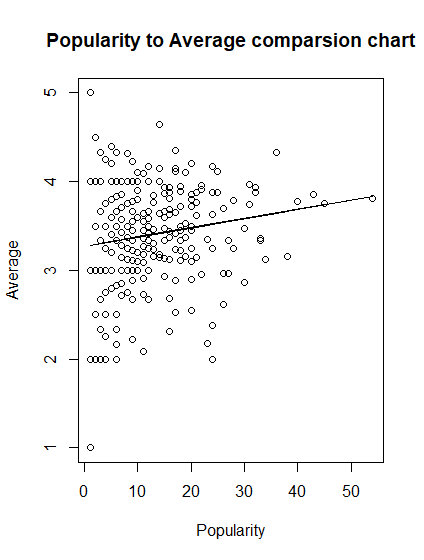

# READ ME

Formula for rating and popularity: Rating=3.273618  + 0.010307 \*Popularity

# Output if you don't wanna run it 

    lm(formula = `Pure Average` ~ Popularity, data = full)

    Residuals:
         Min       1Q   Median       3Q      Max 
    -2.28392 -0.30454  0.04086  0.38275  1.71608 

    Coefficients:
                Estimate Std. Error t value Pr(>|t|)    
    (Intercept) 3.273618   0.049738  65.818   <2e-16 ***
    Popularity  0.010307   0.003649   2.825    0.005 ** 
    ---
    Signif. codes:  0 ‘***’ 0.001 ‘**’ 0.01 ‘*’ 0.05 ‘.’ 0.1 ‘ ’ 1

    Residual standard error: 0.5909 on 357 degrees of freedom
    Multiple R-squared:  0.02186,	Adjusted R-squared:  0.01912 
    F-statistic: 7.978 on 1 and 357 DF,  p-value: 0.005

    [1] "Testing for t score"
    [1] "Linearly significant"
